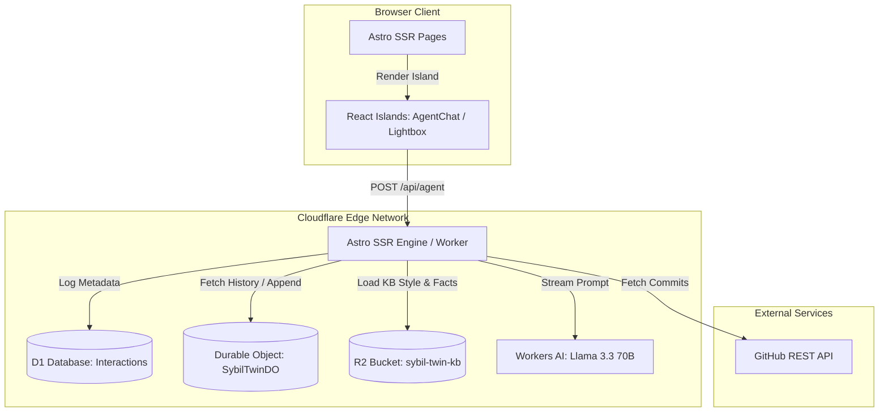

# Codebase Knowledge Base: sybilsedge.com

This document provides a comprehensive technical overview and reference manual for `sybilsedge.com`. It is designed to act as an onboarding guide and master "brain dump" for developers or LLMs implementing new features, resolving bugs, or refactoring the codebase.

---

## 1. High-Level System Overview

`sybilsedge.com` is a personal portfolio and interactive digital identity platform for Sybil Melton. The project is designed with a high-fidelity "cyberpunk blueprint" aesthetic.

### Application Scope & Business Purpose

The system exposes Sybil's professional work, technical writing, creative fiction universes, culinary recipes, and home builds to public visitors, while serving an interactive AI-powered agent interface.

```
┌─────────────────────────────────────────────────────────────────────────┐
│                           sybilsedge.com                                │
├─────────────────┬─────────────────┬───────────────────┬─────────────────┤
│    Status Hub   │  Maker Gallery  │   The Lab (Blog & │  Digital Twin   │
│  (GitHub & Work)│(Projects Archive)│  Recipes)         │ (Interactive AI)│
└─────────────────┴─────────────────┴───────────────────┴─────────────────┘
```

The application is structured around six core capabilities:

1. **Status Hub / Control Plane**: Placed on the homepage to display real-time status and operational state, combining cached live GitHub activity, active creative writing metrics, and deployment health flags.
2. **Maker Gallery (Projects)**: A structural archive showcasing featured technical, home, and garden projects, utilizing step-by-step galleries and progress completion bars.
3. **The Lab (Blog & Culinary)**: A publishing engine dividing technical writing into series-scoped blog posts and culinary presets (baking, cooking, preservation recipes).
4. **Writing Universe System**: A multi-universe creative writing repository containing inter-linked collections of stories, novels, lore, characters, and timelines.
5. **Digital Twin Agent (`/agent`)**: A conversational AI clone that speaks in Sybil's first-person persona. It responds to inquiries about career, biography, writing, and design choices.
6. **Interaction Telemetry**: A backend metrics engine logging incoming agent conversation metadata for traffic analytics.

---

## 2. System Architecture Deep Dive

The platform is built on a serverless Edge-native architecture deploying to Cloudflare's global edge network.

### Technological Stack

* **Core Framework**: [Astro 6](https://astro.build) configured for server-side rendering (SSR) via the `@astrojs/cloudflare` adapter.
* **Content Authoring**: Content is authored in [Markdoc](https://markdoc.dev) format (`.mdoc` files) and standard Markdown, parsed and validated via `@astrojs/markdoc` in Astro Content Collections.
* **Frontend Islands**: [React 19](https://react.dev) integrated via Astro's `client:load` and `client:visible` directives for interactive components.
* **Styling**: [Tailwind CSS v4](https://tailwindcss.com) compiled through `@tailwindcss/vite`.
* **Runtime & Services**:
  * **Cloudflare Workers**: Execution engine for Astro server-side logic and API routes.
  * **Cloudflare Durable Objects**: Transactional in-memory storage providing conversation session history and lock-managed state.
  * **Cloudflare Workers AI**: Large language model inference execution at the Edge.
  * **Cloudflare D1**: SQL database used to log digital twin telemetry.
  * **Cloudflare R2**: Object storage hosting private knowledge-base documents used for prompt construction.

### Technical Architecture Map



### Key Data Flows

#### A. Static/Dynamic Collection SSR
1. A client requests a route (e.g., `/blog/[slug]`).
2. The Cloudflare Worker intercepts the request and invokes Astro's SSR route handler.
3. The content loader reads Markdoc (`.mdoc`) files from the `src/content/` directory at build-time or handles dynamic routing.
4. If a project has related posts, the relations are queried and cross-referenced programmatically.
5. HTML is rendered with embedded hydration JSON and served to the client.

#### B. Digital Twin Conversation Flow
1. **Initiation**: The visitor loads `/agent`. `AgentChat.tsx` reads or generates a session UUID v4 in `localStorage` to identify the conversation.
2. **Inquiry**: The visitor sends a message. The React island posts a payload containing `{ sessionId, message }` to `POST /api/agent`.
3. **Session Fetch**: The API endpoint contacts the `SybilTwinDO` Durable Object stub matched to the `sessionId` to fetch the past 30 days of conversation history.
4. **Telemetry Logging**: D1 prepares and executes a fire-and-forget metadata insert logging the user query, timestamp, and user-agent.
5. **Prompt Assembly**: The server fetches markdown documents from the private `sybil-twin-kb` R2 bucket (caching the resulting system prompt across worker isolates).
6. **Inference Call**: The server submits the system prompt, history, and current message to Workers AI using the `@cf/meta/llama-3.3-70b-instruct-fp8-fast` model.
7. **Streaming & Filtering**: The model streams the response in SSE format. The server interceptor processes the stream in real-time, removing `<think>...</think>` tags while forwarding clean response frames and thinking state flags to the client.
8. **Persistence**: When the stream completes, the final cleaned turn is sent to `SybilTwinDO` to append to the session history.

### Cross-Cutting Concerns

#### Security & Privacy
* **Private R2 Bucket**: The `sybil-twin-kb` bucket has no public endpoints or direct client-facing access. All file reads occur server-side inside the Worker via binding.
* **Content Security Policy (CSP)**: Served dynamically from `public/_headers` on Cloudflare, enforcing strict origin checks.
* **Session ID Validation**: Client-supplied session IDs are verified against a UUID v4 regex pattern prior to invoking Durable Objects to prevent path traversal or injection.

#### Logging & Telemetry
* Telemetry queries are routed to D1 using a non-blocking `cfContext.waitUntil()` promise pattern to avoid adding latency to the client response.

#### Caching
* **GitHub Activity**: Commit lists are cached using the Cloudflare Cache API (`caches.default`) for 10 minutes (`COMMIT_CACHE_TTL_SECONDS = 600`), falling back to unauthenticated public requests if the GitHub API token is missing or rate-limited.

---

## 3. Feature-by-Feature Analysis

### A. Digital Twin Chat Agent
* **Purpose**: Provides an interactive, first-person representation of Sybil to answer professional or personal background inquiries.
* **Technical Mechanism**:
  * **Entry Points**: `/agent` ([agent.astro](file:///src/pages/agent.astro)) mounts `<AgentChat client:load />` ([AgentChat.tsx](file:///src/components/AgentChat.tsx)).
  * **Backend Core**: [agent.ts](file:///src/pages/api/agent.ts) receives the POST body, constructs the context, and routes to Workers AI.
  * **Memory Isolation**: [sybil-twin.ts](file:///src/agent/sybil-twin.ts) (`SybilTwinDO`) stores messages in memory and uses key-value state persistence. An alarm fires 30 days after the last activity, automatically invoking `state.storage.deleteAll()` to enforce a strict session TTL.
  * **System Prompt Generator**: [context.ts](file:///src/agent/context.ts) fetches static resume and bio data and merges it with R2 bucket documents loaded via [r2-context.ts](file:///src/agent/r2-context.ts).
  * **Reasoning Extraction Logic**: A custom look-behind text state machine detects opening `<think>` and closing `</think>` tags. The server intercepts these frames, emits `thinking: true` and `thinking: false` signals to coordinate the UI status, and buffers/strips the raw reasoning text to prevent leaks. A sliding 8-character buffer window (`TAG_WINDOW`) prevents tag leakage across SSE boundaries.

### B. Multi-Universe Fiction System
* **Purpose**: Hosts an inter-linked universe, story, novel, lore, and timeline database.
* **Technical Structure**:
  * **Frontmatter Schemas**: Defined in [content.config.ts](file:///src/content.config.ts) for `universes`, `characters`, `novels`, `shortStories`, `lore`, and `timeline` collections. Image fields use the `optionalImage()` preprocessor to gracefully handle optional image objects.
  * **Relations**: Relational arrays (e.g. `relatedCharacters`, `relatedStories`, `relatedLore`) use slugs to construct cross-reference links.
  * **UI Components**:
    * `<LoreFilter />` ([LoreFilter.tsx](file:///src/components/LoreFilter.tsx)) manages client-side categorization and spoiler levels.
    * `<NovelCard />`, `<StoryCard />`, `<LoreCard />` act as stylized, themed display adapters.

### C. Maker Gallery (Projects)
* **Purpose**: Showcases technical builds, home improvements, and gardening projects.
* **Technical Structure**:
  * **Metadata**: Classified by `category: z.enum(['tech', 'home', 'garden'])` and `status: z.enum(['active', 'complete', 'archived', 'wip'])`.
  * **Progress Bar**: Uses an optional `progress` integer (0–100) rendered as a schematic progress track in `<TechCard />` ([TechCard.astro](file:///src/components/TechCard.astro)).
  * **Structured Data**: Injects `SoftwareApplication` or `CreativeWork` JSON-LD schemas via `<ProjectJsonLd />` ([ProjectJsonLd.astro](file:///src/components/ProjectJsonLd.astro)).

### D. Culinary Presets (Kitchen / Recipes)
* **Purpose**: Formulates a cooking and baking reference portal.
* **Technical Structure**:
  * **Metadata**: Maps to prep time, cook time, servings, ingredients list, and instructional steps.
  * **SEO Schema**: Houses a `schema.org/Recipe` template compiled through `<RecipeJsonLd />` ([RecipeJsonLd.astro](file:///src/components/RecipeJsonLd.astro)).

### E. Tech Blog
* **Purpose**: Organizes technical publications.
* **Technical Structure**:
  * **Series Aggregation**: Groups posts into multi-part sequences (represented by the `series` collection schema and displayed on `/blog/series/[slug]`).
  * **Feeds**: Emits RSS metadata under `/feed.xml` and `/blog/rss.xml`.

### F. Status Hub
* **Purpose**: Renders real-time developer metrics and logs.
* **Technical Structure**:
  * **Implementation**: Located in [StatusFeed.astro](file:///src/components/StatusFeed.astro).
  * **Caching Mechanism**: Fetches commits from GITHUB_REPOS. It attempts to load from `caches.default` with a request key matching the target endpoint. On a cache miss, it fetches with headers, performs a cache write, and returns.

---

## 4. Nuances, Subtleties & Gotchas

### A. The Durable Object Bundling Plugin
* **The Problem**: Astro adapter configurations target Web Workers which enforce `inlineDynamicImports: true` in Rollup. This setting throws an error if multiple entry points (such as an independent Durable Object bundle) are registered.
* **The Solution**: A custom Vite plugin, `durableObjectsPlugin()`, is registered in [astro.config.mjs](file:///astro.config.mjs). It uses a bundled instance of `esbuild` to compile `src/agent/sybil-twin.ts` into a self-contained IIFE, then appends this IIFE to the final `_worker.js` chunk with a top-level `export { SybilTwinDO }`.

```
[ Rollup Compile SSR Worker ] ──> Generates entry.mjs/entry.js
                                        │
[ durableObjectsPlugin ] ──────────────> Compiles sybil-twin.ts via esbuild (IIFE)
                                        │
                                        ▼
Appends IIFE + "export { SybilTwinDO };" to entry.mjs
```

### A-2. Conditional Adapter for Local Development
* **The Problem**: Cloudflare's `workerd` runtime (used by the Cloudflare adapter in dev) behaves differently from Node.js during development.
* **The Solution**: In [astro.config.mjs](file:///astro.config.mjs), the `adapter` and `vite.ssr` settings are **conditional on `isProd`** (`NODE_ENV === 'production'` or `process.argv.includes('build')`). During local development, no adapter is loaded — Astro falls back to its native Node.js dev server. In production builds, the full Cloudflare adapter with `ssr.target: 'webworker'` and `ssr.noExternal: true` is activated.

### B. Post-Build Wrangler Patching
* **The Problem**: The `@astrojs/cloudflare` adapter generates an invalid `wrangler.json` inside the build output folder. It contains an empty `triggers: {}` block and `kv_namespaces` stubs with no IDs, both of which cause deployment failures.
* **The Solution**: `scripts/patch-wrangler.mjs` runs at `postbuild`. It deletes these invalid properties and injects the runtime configurations for `AI`, `SYBIL_TWIN` Durable Objects, D1 database migrations, and `SYBIL_TWIN_KB` R2 buckets directly into `dist/server/wrangler.json`.

### C. Voice Control & Personality Remapping
* **Strict First-Person Pronouns**: The digital twin must never refer to itself as "Sybil," "she," or "her." This rule is strictly enforced at the prompt level. Any third-person reference is treated as an execution failure.
* **Quote Translations**: The prompt instructs the agent to avoid common AI intro templates (e.g. "As Alan Watts once said..."). Instead, the model is guided to translate philosophical quotes into engineering metaphors:
  * **Hot Coal (Resentment)** $\rightarrow$ *Cognitive Resource Leak* (drains CPU, flush the buffer and move on).
  * **Wake of a Ship (Past failures)** $\rightarrow$ *Stateless Execution* (past history is just the trailing wake; it does not drive current heading).
  * **Present Moment (Mindfulness)** $\rightarrow$ *Real-Time Telemetry* (check active logs and metrics; do not panic about yesterday).
  * **Plunge into Change (Watts)** $\rightarrow$ *Continuous Deployment* (change is the natural, healthy state of the system).

---

## 5. Technical Reference & Glossary

### Glossary of Domain Terms

* **NMCI NOC**: Navy Marine Corps Intranet Network Operations Center, Norfolk, VA. Formative network engineering experience for Sybil.
* **Aegis Missile Defense**: Military shipboard combat system. Emphasized in prompt context as the root of Sybil's high-availability hardware troubleshooting principles.
* **XAoC**: A fictional cybernetic megacorporation in Sybil's sci-fi world-building project *The Shadow Docket*.
* **Shellback**: Naval slang for sailors who have crossed the equator.
* **FOUC**: Flash of Unstyled Content. Remedied in `Layout.astro` via an inline head script.
* **Scribophile**: An online writing group where Sybil is an active author.

### Database Schema (D1 SQL)

#### Table: `twin_interactions`
Logged in [agent.ts](file:///src/pages/api/agent.ts) to track digital twin metrics.

| Field | Type | Flags | Description |
| :--- | :--- | :--- | :--- |
| `id` | `INTEGER` | `PRIMARY KEY AUTOINCREMENT` | Auto-incrementing identifier. |
| `timestamp` | `TEXT` | `NOT NULL` | ISO 8601 string of the interaction. |
| `session_id` | `TEXT` | `NOT NULL` | UUID v4 conversation session identifier. |
| `message` | `TEXT` | `NOT NULL` | Text of the user's prompt. |
| `is_new_session` | `INTEGER` | `NOT NULL DEFAULT 0` | Flag (0 or 1) indicating if this is the session's first turn. |
| `session_status` | `TEXT` | `NULL` | Status state string (`'new'` or `'existing'`). |
| `user_agent` | `TEXT` | `NULL` | Browser User-Agent header string. |
| `referrer` | `TEXT` | `NULL` | Referrer header string. |

#### Indices:
* `idx_session_id` $\rightarrow$ `ON twin_interactions(session_id)`
* `idx_timestamp` $\rightarrow$ `ON twin_interactions(timestamp)`

---

### Internal API Reference

#### `POST /api/agent`
Processes client chat prompts, fetches memory, runs AI inference, streams responses, and persists logs.

##### Request Headers:
* `Content-Type: application/json`

##### Request Body:
```json
{
  "sessionId": "4c5df4af-29d6-44ad-bb6b-44f91f300004",
  "message": "Tell me about your experience stationed on the USS Barry."
}
```

##### Responses:
* **`200 OK`**: Streams event frames.
* **`400 Bad Request`**: Returns JSON error if session ID is not a UUID v4 or message length exceeds 2,000 characters.
* **`503 Service Unavailable`**: Workers AI endpoint failure.

##### SSE Stream Event Frames:
```text
data: {"thinking": true}

data: {"response": "I "}

data: {"response": "served "}

data: {"response": "onboard "}

data: {"thinking": false}

data: [DONE]
```

---

## 6. Complete File Index & Prioritization

The following table summarizes the key files in the repository.

* **Priority Score**:
  * `+` : High coupling, core architecture, routing entry point, or system configuration.
  * `–` : Static content collections, standard styles, or general utilities.

| (#) | PRIORITY | PATH | TYPE | LINES | HASH8 | NOTES |
| :---: | :---: | :--- | :---: | :---: | :---: | :--- |
| 1 | `+` | [package.json](file:///package.json) | Config | 36 | `888` | Core project description, scripts, and production dependencies. |
| 2 | `+` | [astro.config.mjs](file:///astro.config.mjs) | Config | 118 | `261ed8ad` | Adapters (conditional dev/prod), integrations, and the esbuild Durable Object builder. |
| 3 | `+` | [wrangler.jsonc](file:///wrangler.jsonc) | Config | 30 | `557` | Primary wrangler configuration; contains D1 binding specifications. |
| 4 | `+` | [markdoc.config.mjs](file:///markdoc.config.mjs) | Config | 12 | `–` | Markdoc tag definitions (e.g. `blueprintGallery`) mapping to Astro wrapper components. |
| 6 | `+` | [scripts/patch-wrangler.mjs](file:///scripts/patch-wrangler.mjs) | Script | 90 | `57bd97b4` | Post-build wrangler binder and Astro adapter compiler patcher. |
| 7 | `+` | [migrations/0001_twin_interactions.sql](file:///migrations/0001_twin_interactions.sql) | DDL | 13 | `d71ab5e5` | Initial D1 schema creation script for interaction logs. |
| 8 | `+` | [src/agent/types.ts](file:///src/agent/types.ts) | Types | 43 | `1146` | Validation schemas, session regex rules, and session TTL configuration. |
| 9 | `+` | [src/agent/context.ts](file:///src/agent/context.ts) | Logic | 137 | `7060` | Main assembly function compiling system prompt text. |
| 10 | `+` | [src/agent/r2-context.ts](file:///src/agent/r2-context.ts) | Logic | 186 | `6408` | Private R2 object loader and character size constraint manager. |
| 11 | `+` | [src/agent/sybil-twin.ts](file:///src/agent/sybil-twin.ts) | Class | 75 | `2559` | Durable Object storage class managing active session memory. |
| 12 | `+` | [src/pages/api/agent.ts](file:///src/pages/api/agent.ts) | Route | 384 | `8310aa2b` | Streaming endpoint handling Workers AI and SSE frame generation. |
| 13 | `+` | [src/components/AgentChat.tsx](file:///src/components/AgentChat.tsx) | Island | 270 | `9008` | Frontend chat wrapper and stream parser React component. |
| 14 | `+` | [src/content.config.ts](file:///src/content.config.ts) | Config | 227 | `9410` | Astro Content Collections loaders, validation schemas, and `optionalImage()` preprocessor. |
| 15 | `+` | [src/components/StatusFeed.astro](file:///src/components/StatusFeed.astro) | Island | 344 | `4e605c78` | Edge-cached GitHub commit reader and writing progress metrics. |
| 16 | `+` | [src/styles/global.css](file:///src/styles/global.css) | Styles | 259 | `261ed8ad` | Global CSS declarations, dark mode tokens, and blueprint variables. |
| 17 | `+` | [src/layouts/Layout.astro](file:///src/layouts/Layout.astro) | Layout | 99 | `5c7c2851` | Master layout framework; manages FOUC mitigation. |
| 18 | `–` | [docs/r2-kb-runbook.md](file:///docs/r2-kb-runbook.md) | Docs | 208 | `b4d85118` | Reference manual for managing private R2 bucket documents. |
| 20 | `–` | [src/data/about.ts](file:///src/data/about.ts) | Data | 31 | `f8ae47f6` | Static bio profiles and timeline data. |
| 21 | `–` | [src/data/resume.ts](file:///src/data/resume.ts) | Data | 102 | `b6bec988` | Career history records and credentials lists. |
| 22 | `–` | [src/utils/gallery.ts](file:///src/utils/gallery.ts) | Util | 83 | `da708aa0` | Astro image preprocessing utilities. |
| 23 | `–` | [src/components/TechCard.astro](file:///src/components/TechCard.astro) | Card | 93 | `161fd528` | Specialized Maker Gallery card rendering progress metrics. |
| 24 | `–` | [src/components/TheLab.astro](file:///src/components/TheLab.astro) | Column | 90 | `28610746` | Homepage panel displaying blog and recipe feeds. |
| 25 | `–` | [src/components/BlueprintGallery.astro](file:///src/components/BlueprintGallery.astro) | Column | 54 | `3371` | Homepage column sorting and showcasing featured project cards. |
| 26 | `–` | [src/components/BlueprintGalleryWrapper.astro](file:///src/components/BlueprintGalleryWrapper.astro) | Wrapper | 9 | `–` | Markdoc hydration boundary mounting the React BlueprintGallery island. |
| 27 | `–` | [src/pages/index.astro](file:///src/pages/index.astro) | Page | 28 | `aab6eece` | Platform homepage mounting column adapters. |
| 28 | `–` | [src/pages/agent.astro](file:///src/pages/agent.astro) | Page | 25 | `5f90ef40` | Router page mounting the React chat island. |
| 29 | `–` | [src/pages/blog/\[slug\].astro](file:///src/pages/blog/[slug].astro) | Page | 375 | `1a1876a1` | Custom blog detail viewport template. |
| 30 | `–` | [src/pages/kitchen/\[slug\].astro](file:///src/pages/kitchen/[slug].astro) | Page | 318 | `a33ab1b9` | Culinary recipe presentation template. |
| 31 | `–` | [src/pages/projects/\[slug\].astro](file:///src/pages/projects/[slug].astro) | Page | 222 | `78eea6e8` | Project showcase layout template. |
| 32 | `–` | [src/components/ProjectJsonLd.astro](file:///src/components/ProjectJsonLd.astro) | SEO | 49 | `c332b828` | JSON-LD schema builder for projects. |
| 33 | `–` | [src/components/RecipeJsonLd.astro](file:///src/components/RecipeJsonLd.astro) | SEO | 68 | `76516a85` | JSON-LD schema builder for culinary presets. |
| 34 | `–` | [src/components/ThemeToggle.tsx](file:///src/components/ThemeToggle.tsx) | Widget | 50 | `769b8416` | Client theme swapper widget. |

---

## 7. Development and Deployment Runbook

### Local Environment Setup
1. Clone the repository to your local workspace.
2. Install the necessary project dependencies:
   ```bash
   npm install
   ```
3. Prepare a local secrets definition file `.dev.vars` inside the project root:
   ```env
   GITHUB_TOKEN=github_pat_your_fine_grained_token
   ```
4. Fire up the Astro local development server:
   ```bash
   npm run dev
   ```

### Production Build & Deploy Pipeline
1. Compile the build bundle and run postbuild patches:
   ```bash
   npm run build
   ```
   *Note: This command generates the optimized production assets and executes `scripts/patch-wrangler.mjs` to patch the wrangler bindings.*
2. Deploy the patched compilation bundle to Cloudflare Workers:
   ```bash
   npx wrangler deploy
   ```
